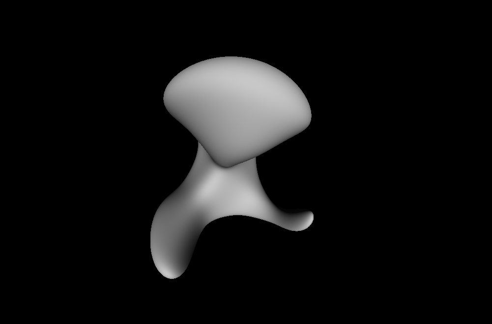

# sdf_renderer
3D visualizer for parametric signed distance field (SDF) objects. 
The meshes are ray traced on the GPU using CUDA. 
A python interface is provided to facilitate experimentation.

# GUI with keyboard control

